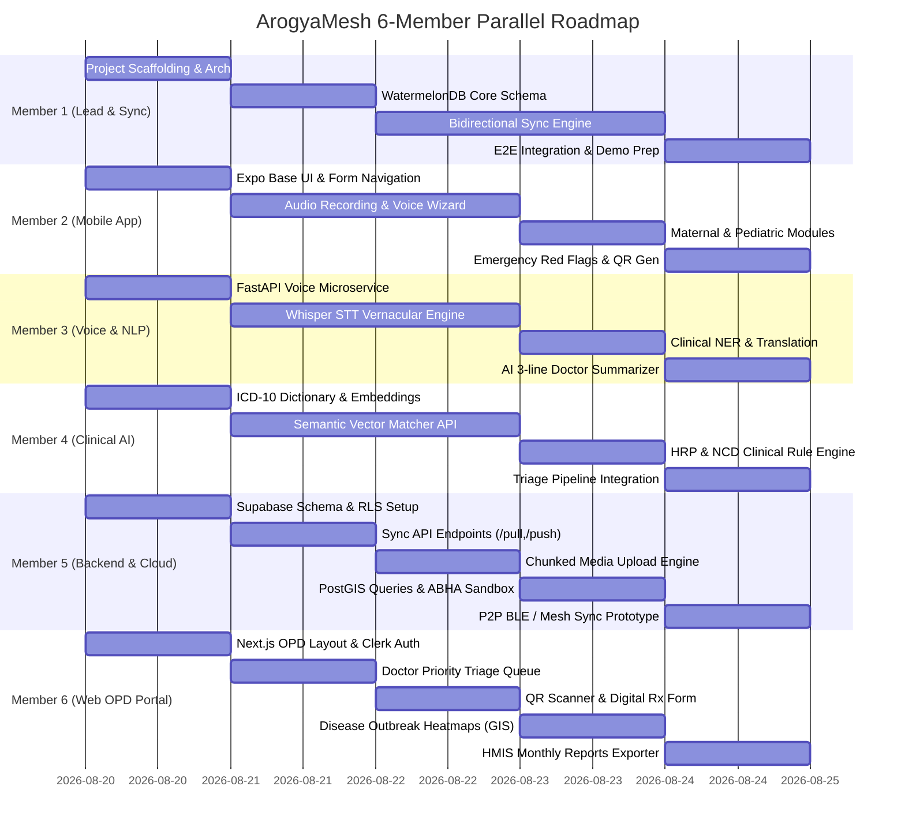

# ArogyaMesh — Feature Breakdown & Work Allocation Document (6-Person Team)

> **Document Purpose:** Detailed technical feature breakdown, deliverables, role assignments, and dependency mapping to distribute work across a 6-member team for hackathon / sprint execution.

---

## 👥 6-Member Team Structure & Role Assignments

| Member | Assigned Role | Primary Focus Area | Core Stack |
| :--- | :--- | :--- | :--- |
| **Member 1 (You - Team Lead & Fullstack Integrator)** | Lead Architect & Sync Lead | System architecture, End-to-end integration, Bidirectional Sync protocol, Auth & Security orchestration | React Native, Supabase, FastAPI, Clerk |
| **Member 2 (Mobile Frontend & UX)** | ASHA Mobile App Dev | Expo UI/UX, Vernacular audio recorder UI, Vitals input wizard, Offline UX, Alert modals | React Native (Expo), WatermelonDB, Expo-AV |
| **Member 3 (AI / Speech & NLP)** | Voice & NLP Engineer | Vernacular Speech-to-Text (Whisper / IndicWav2Vec), Clinical NER extraction, AI Doctor Case Summarizer | Python, FastAPI, HuggingFace, Whisper, IndicNLP |
| **Member 4 (Clinical AI & Triage Logic)** | Medical Knowledge & Rule Eng | ICD-10 vector embeddings matcher, High-Risk Pregnancy (HRP) rule engine, NCD risk scoring matrix | Python, SentenceTransformers, NumPy, Scikit-learn |
| **Member 5 (Backend, Cloud & Edge Sync)** | Cloud & P2P Protocols Dev | Supabase PostgreSQL schema, PostGIS, Resumable chunked audio sync, P2P Bluetooth/Wi-Fi Direct sync, ABHA API | Supabase, PostgreSQL, Node.js/Python, BLE APIs |
| **Member 6 (Web OPD Portal & Analytics)** | Fullstack Web & Dashboard Dev | Next.js Doctor OPD portal, Dynamic triage queue, Digital prescriptions, Disease cluster heatmaps, HMIS reports | Next.js (App Router), Tailwind CSS, Leaflet/Mapbox |

---

## 📋 Comprehensive Feature Breakdown (20 Features)

```
Domain A: Voice & Edge Intake Layer (ASHA App + AI Engine)
Domain B: Offline Storage & Data Sync Engine (Edge + Cloud)
Domain C: Clinical Decision Support & Risk Triaging (Rules + AI)
Domain D: Referral & Doctor OPD Workflows (Mobile + Web)
Domain E: Identity, Security, Analytics & Reporting (Fullstack + Admin)
```

---

### 🎙️ DOMAIN A: Voice & Edge Intake Layer

#### Feature 01: Vernacular Voice Note Intake
* **Primary Owners:** Member 2 (Mobile UI) + Member 3 (AI Speech)
* **Complexity:** Medium (4 pts)
* **Description:** Frontline ASHA workers record voice narratives of patient symptoms in regional languages (Telugu, Hindi, etc.) with a single press-and-hold / one-tap voice recorder.
* **Key Deliverables:**
  - **Member 2 (Mobile):** Native audio recording module using `expo-av` with live waveform visualizer, pause/resume/review controls, and offline file caching.
  - **Member 3 (AI):** FastAPI endpoint `POST /api/voice/transcribe` utilizing Whisper / IndicWav2Vec for regional dialect transcription with audio normalization.
* **Acceptance Criteria:**
  - Audio files under 2MB recorded smoothly on edge devices and transcribed into text within 3 seconds when online.

---

#### Feature 02: Clinical Entity Extraction (NER)
* **Primary Owner:** Member 3 (Voice & NLP Engineer)
* **Complexity:** High (5 pts)
* **Description:** Natural Language Processing pipeline extracting symptoms, duration, anatomical sites, severity, and medication history from raw speech transcriptions.
* **Key Deliverables:**
  - **Member 3 (AI):** Entity extraction pipeline parsing vernacular clinical terms (`symptoms`, `duration_days`, `body_site`, `severity`, `current_meds`).
  - **Member 3 (AI):** Translation submodule mapping regional colloquial phrases (e.g., "తల తిరుగుతుంది" / "చక్కర్ ఆనా") to standardized English clinical terms ("Dizziness / Vertigo").
* **Acceptance Criteria:**
  - Extracts key entities from unstructured rural voice notes with >85% precision.

---

#### Feature 03: Automated ICD-10 & SNOMED-CT Mapping
* **Primary Owner:** Member 4 (Medical Knowledge & Rule Eng)
* **Complexity:** High (5 pts)
* **Description:** Semantic vector search engine mapping extracted symptoms and provisional conditions into standardized ICD-10 diagnostic codes and SNOMED terms.
* **Key Deliverables:**
  - **Member 4 (Clinical AI):** Pre-indexed vector store and lookup dictionary of rural primary health conditions and ICD-10-CM codes.
  - **Member 4 (Clinical AI):** Semantic matcher using lightweight embeddings (`all-MiniLM-L6-v2`) to return top-3 matching diagnostic codes with confidence scores.
* **Acceptance Criteria:**
  - Accurately codes high-priority conditions like Preeclampsia (`O14.90`), Gestational Diabetes (`O24.4`), and Severe Anemia (`D64.9`).

---

#### Feature 04: Interactive Voice & Audio Wizard Prompts
* **Primary Owner:** Member 2 (Mobile Frontend & UX)
* **Complexity:** Medium (3 pts)
* **Description:** Step-by-step audio prompts in the selected dialect guiding ASHA workers to capture missing mandatory clinical vitals (BP, Blood Glucose, Fetal Heart Rate, Hemoglobin).
* **Key Deliverables:**
  - **Member 2 (Mobile):** Dynamic form wizard checking for missing vital parameters based on chief complaint.
  - **Member 2 (Mobile):** Audio prompt player playing localized audio assets in Telugu/Hindi: *"Please record patient's blood pressure"* / *"Measure blood sugar"*.
* **Acceptance Criteria:**
  - Missing vital fields trigger localized audio reminders before encounter submission.

---

### 🔄 DOMAIN B: Offline Storage & Data Sync Engine

#### Feature 05: Local-First Reactive Edge Storage (WatermelonDB)
* **Primary Owners:** Member 1 (Lead Integrator) + Member 2 (Mobile Dev)
* **Complexity:** High (5 pts)
* **Description:** 100% offline-functional SQLite database using WatermelonDB in React Native, allowing instant read/write of patient profiles and clinical encounters without internet.
* **Key Deliverables:**
  - **Member 1 (Lead):** WatermelonDB schema design, migrations, and model definitions matching cloud PostgreSQL tables (`patients`, `clinical_encounters`, `referrals`).
  - **Member 2 (Mobile):** Reactive UI bindings (`withObservables`) ensuring 60fps rendering and fast search indexing across 1,000+ cached patient records.
* **Acceptance Criteria:**
  - Complete CRUD operations on patient records execute in <50ms with device in Airplane Mode.

---

#### Feature 06: Conflict-Free Bidirectional Synchronization
* **Primary Owners:** Member 1 (Lead Integrator) + Member 5 (Backend Dev)
* **Complexity:** Very High (8 pts)
* **Description:** Robust sync engine using delta-changes and Last-Write-Wins (LWW) / deterministic timestamps to sync mobile changes with Supabase PostgreSQL upon network reconnection.
* **Key Deliverables:**
  - **Member 5 (Backend):** `POST /api/sync/pull` (fetching delta records updated after `last_pulled_at`) and `POST /api/sync/push` (validating schema, auth RLS, and batch inserts).
  - **Member 1 (Lead):** WatermelonDB `synchronize()` adapter on mobile, background network listener (`@react-native-community/netinfo`), and sync status indicators (`SYNCED`, `PENDING`, `SYNCING`).
* **Acceptance Criteria:**
  - Offline changes sync to cloud within 5 seconds of reconnecting without data loss or duplicate records.

---

#### Feature 07: P2P Mesh Field Transfer (BLE / Wi-Fi Direct)
* **Primary Owner:** Member 5 (Cloud & P2P Protocols Dev)
* **Complexity:** High (5-8 pts)
* **Description:** Direct device-to-device synchronization allowing ASHA workers to offload collected batch records to the PHC tablet / supervisor device in zero-internet field conditions.
* **Key Deliverables:**
  - **Member 5 (Backend/P2P):** BLE / Local Wi-Fi hotspot handshake protocol between ASHA phone and PHC Master device.
  - **Member 5 (Backend/P2P):** Encrypted JSON delta packager with SHA-256 checksum verification to avoid duplicate intake entries.
* **Acceptance Criteria:**
  - 50+ patient records successfully transferred peer-to-peer between two mobile devices with zero cellular/Wi-Fi internet.

---

#### Feature 08: Chunked & Resumable Media Sync
* **Primary Owner:** Member 5 (Cloud & P2P Protocols Dev)
* **Complexity:** Medium (4 pts)
* **Description:** Background daemon for uploading voice audio recordings in encrypted chunks with automatic pause and resume over unstable 2G/3G connections.
* **Key Deliverables:**
  - **Member 5 (Backend):** Supabase Storage bucket integration with presigned chunk upload endpoints.
  - **Member 5 (Backend):** Background upload queue manager handling retry backoffs and low-bandwidth throttling.
* **Acceptance Criteria:**
  - Network interruption during 5MB audio upload resumes from the last uploaded chunk upon reconnection.

---

### 🩺 DOMAIN C: Clinical Decision Support & Risk Triaging

#### Feature 09: High-Risk Pregnancy (HRP) Flagging Engine
* **Primary Owners:** Member 4 (Clinical AI) + Member 2 (Mobile UI)
* **Complexity:** Medium (4 pts)
* **Description:** Rule-based and edge clinical algorithm evaluating Antenatal Care (ANC) markers to flag high-risk pregnancies (e.g., BP > 140/90, Hb < 7 g/dL, severe pedal edema, abnormal gestational age).
* **Key Deliverables:**
  - **Member 4 (Clinical AI):** Deterministic clinical decision logic based on MoHFW / WHO maternal triage guidelines.
  - **Member 2 (Mobile):** On-device risk evaluation widget immediately computing `triage_priority` (`ROUTINE`, `MODERATE`, `CRITICAL`) with high-contrast alert badges.
* **Acceptance Criteria:**
  - Instantly flags high-risk maternal vitals on the mobile device without network latency.

---

#### Feature 10: Non-Communicable Disease (NCD) Triaging Matrix
* **Primary Owners:** Member 4 (Clinical AI) + Member 6 (Web OPD)
* **Complexity:** Medium (3 pts)
* **Description:** Cardiovascular and diabetes risk calculator scoring patients based on age, BMI, blood pressure, random blood sugar, and lifestyle/family risk factors.
* **Key Deliverables:**
  - **Member 4 (Clinical AI):** NCD Risk Calculator (based on Indian CBAC checklist) evaluating hypertension and diabetes severity.
  - **Member 6 (Web OPD):** Doctor dashboard view highlighting high-risk NCD patients with color-coded risk meter (Green/Yellow/Red).
* **Acceptance Criteria:**
  - Accurate categorization of patients into Low, Moderate, or High NCD risk tiers.

---

#### Feature 11: Pediatric Growth & Immunization Tracker
* **Primary Owner:** Member 2 (Mobile Frontend & UX)
* **Complexity:** Medium (4 pts)
* **Description:** WHO-standardized child growth curve engine (weight-for-age, height-for-age) with automated edge schedule alerts for upcoming and overdue vaccinations.
* **Key Deliverables:**
  - **Member 2 (Mobile):** Universal Immunization Schedule tracker (BCG, OPV, Pentavalent, Rotavirus, Measles-Rubella).
  - **Member 2 (Mobile):** Anthropometric calculator detecting Severe Acute Malnutrition (SAM) / Moderate Acute Malnutrition (MAM).
* **Acceptance Criteria:**
  - Calculates malnutrition status and highlights overdue vaccines based on child birth date.

---

#### Feature 12: Critical Red-Flag Alarms & Emergency Escalation
* **Primary Owner:** Member 2 (Mobile Frontend & UX)
* **Complexity:** Low-Medium (3 pts)
* **Description:** Visual and auditory emergency alerts triggering immediate escalation protocols for life-threatening symptoms (e.g., Postpartum Hemorrhage, Eclampsia, severe respiratory distress).
* **Key Deliverables:**
  - **Member 2 (Mobile):** High-priority modal with audible warning siren/chime for red-flag symptoms.
  - **Member 2 (Mobile):** Emergency action buttons: One-tap dial for 108 Emergency Ambulance & PHC Medical Officer.
* **Acceptance Criteria:**
  - Triggering a critical symptom displays full-screen red warning and direct dial actions.

---

### 🏥 DOMAIN D: Referral & Clinical Workflow

#### Feature 13: Dynamic QR-Coded Referral Slips & Scanner
* **Primary Owners:** Member 2 (Mobile QR Gen) + Member 6 (Web QR Scanner)
* **Complexity:** Medium (4 pts)
* **Description:** Generates offline-scannable, compressed, and encrypted QR codes encapsulating full patient vitals, diagnosis, and triage state for physical referral handoffs to secondary hospitals.
* **Key Deliverables:**
  - **Member 2 (Mobile):** Offline QR Code generator compressing patient clinical encounter payload (gzip + Base64).
  - **Member 6 (Web):** Camera/Scanner module on Doctor Web portal to instantly scan QR and populate patient chart in zero clicks.
* **Acceptance Criteria:**
  - QR code scanned on web or mobile recreates complete encounter details without internet access.

---

#### Feature 14: PHC Doctor OPD Triage Priority Queue
* **Primary Owner:** Member 6 (Web OPD Portal & Analytics)
* **Complexity:** High (5 pts)
* **Description:** Medical Officer web portal displaying incoming OPD patients dynamically ordered by clinical triage severity (`CRITICAL` > `MODERATE` > `ROUTINE`) rather than arrival sequence.
* **Key Deliverables:**
  - **Member 6 (Web):** Next.js Doctor OPD dashboard with Supabase Realtime subscription for live patient queue updates.
  - **Member 6 (Web):** Priority cards with color-coded triage badges, chief complaints, and vitals anomaly highlights.
* **Acceptance Criteria:**
  - Critical/high-risk patients automatically float to the top of the queue with visual pulsating indicators.

---

#### Feature 15: One-Tap Prescription & Tele-Consult Integration
* **Primary Owner:** Member 6 (Web OPD Portal & Analytics)
* **Complexity:** Medium (4 pts)
* **Description:** Streamlined OPD consultation interface allowing doctors to prescribe standard rural drug formularies, order diagnostic tests, or forward cases for District Hospital tele-consultation.
* **Key Deliverables:**
  - **Member 6 (Web):** Essential Drugs List (EDL) quick-prescriber component with standard dosages and frequency tags.
  - **Member 6 (Web):** Referral forwarding module to escalate case notes to district specialists with printable digital Rx slips.
* **Acceptance Criteria:**
  - Doctor completes consultation and issues digital prescription in under 60 seconds.

---

#### Feature 16: Voice-to-Text Clinical Summary for Doctors
* **Primary Owners:** Member 3 (Voice & NLP) + Member 6 (Web OPD UI)
* **Complexity:** Medium (4 pts)
* **Description:** AI-generated 3-line structured clinical digest summarizing ASHA field audio notes and vitals history into an executive summary for rapid OPD review.
* **Key Deliverables:**
  - **Member 3 (AI):** Summarization prompt pipeline converting transcribed regional voice notes and vitals into a 3-bullet clinical digest (Chief Complaint, Vitals Anomaly, Provisional Assessment).
  - **Member 6 (Web):** "AI Clinical Digest" card inside the doctor's patient detail drawer with audio playback widget.
* **Acceptance Criteria:**
  - Summary accurately abstracts the field note and renders in the doctor OPD drawer.

---

### 🛡️ DOMAIN E: Identity, Security, Analytics & Reporting

#### Feature 17: ABHA (Ayushman Bharat Health Account) Integration
* **Primary Owners:** Member 5 (Cloud Backend) + Member 2 (Mobile Dev)
* **Complexity:** Medium (4 pts)
* **Description:** Patient identity module enabling lookup, validation, and generation of 14-digit ABHA IDs via OTP verification and demographic matching.
* **Key Deliverables:**
  - **Member 5 (Backend):** Sandbox ABHA API connector for Aadhaar/Mobile OTP validation and ABHA ID creation.
  - **Member 2 (Mobile):** ABHA card scanner (Barcode/QR) and 14-digit ABHA entry component with validation rules.
* **Acceptance Criteria:**
  - Validates ABHA ID format and links patient record across visits.

---

#### Feature 18: Role-Based Encrypted Data Storage (RBAC & Auth)
* **Primary Owners:** Member 1 (Lead Integrator) + Member 5 (Backend Dev)
* **Complexity:** Medium-High (5 pts)
* **Description:** End-to-end security implementing local AES-256 encryption on mobile databases, Clerk authentication with mobile OTP, and Supabase Row-Level Security (RLS) policies.
* **Key Deliverables:**
  - **Member 1 (Lead):** Clerk Auth configuration for Mobile OTP login for ASHA workers and Email/Password MFA for Doctors/Admins.
  - **Member 5 (Backend):** Supabase Row-Level Security (RLS) policies restricting ASHA access strictly to their assigned village catchment area.
* **Acceptance Criteria:**
  - ASHA workers cannot query or view records outside their assigned jurisdiction.

---

#### Feature 19: Automated Monthly Indicator Reports (HMIS Compliance)
* **Primary Owners:** Member 6 (Web Reporting) + Member 5 (DB Queries)
* **Complexity:** Medium (4 pts)
* **Description:** One-click generation of standard Health Management Information System (HMIS) monthly indicator reports, eliminating manual calculations for ASHA and PHC staff.
* **Key Deliverables:**
  - **Member 5 (Backend):** SQL aggregation functions calculating monthly maternal/child metrics (ANC registrations, institutional deliveries, immunization counts, NCD screenings).
  - **Member 6 (Web):** Monthly Report generator UI with PDF / CSV export functionality.
* **Acceptance Criteria:**
  - Generates downloadable compliance-ready HMIS summary table with accurate aggregated metrics.

---

#### Feature 20: Epidemiological Cluster Heatmaps & Outbreak Analytics
* **Primary Owners:** Member 6 (Web GIS) + Member 5 (PostGIS)
* **Complexity:** High (5 pts)
* **Description:** District-level administrative dashboard visualizing geospatial disease patterns, identifying emerging infectious disease clusters (e.g., Dengue, Malaria, Diarrhea) in real time.
* **Key Deliverables:**
  - **Member 5 (Backend):** PostGIS spatial queries aggregating symptom cases by village coordinates.
  - **Member 6 (Web):** Interactive Leaflet / Mapbox map showing disease density heatmaps, village marker clusters, and outbreak threshold alert banners (+30% WoW spike).
* **Acceptance Criteria:**
  - Disease clusters visually highlight on the district map with filtering by date range and symptom type.

---

## 📊 6-Member Work Allocation Matrix

| Team Member | Role / Track | Primary Assigned Features | Est. Points | Core Technologies |
| :--- | :--- | :--- | :---: | :--- |
| **Member 1 (You)** | **Lead & Integrator** | **F05** (WatermelonDB Core), **F06** (Bidirectional Sync), **F18** (Clerk Auth & Security Architecture), **E2E Integration & Demo** | **18 pts** | React Native, Supabase, FastAPI, Clerk |
| **Member 2** | **Mobile Frontend & UX** | **F01** (Audio UI), **F04** (Voice Prompts Wizard), **F09** (HRP UI), **F11** (Pediatric Tracker), **F12** (Red Flag Alerts), **F13** (QR Gen) | **21 pts** | React Native (Expo), Expo-AV, WatermelonDB Observables |
| **Member 3** | **Voice & NLP Engineer** | **F01** (STT API), **F02** (Clinical NER & Translation), **F16** (AI Doctor Case Summary Pipeline) | **13 pts** | Python, FastAPI, Whisper, IndicNLP, HuggingFace |
| **Member 4** | **Clinical AI & Rules** | **F03** (ICD-10 Vector Matcher), **F09** (Maternal HRP Engine), **F10** (NCD Triaging Matrix) | **12 pts** | Python, SentenceTransformers, Scikit-learn, Vector DB |
| **Member 5** | **Backend & Cloud Sync** | **F07** (P2P Mesh Sync), **F08** (Chunked Media Sync), **F17** (ABHA Sandbox), **F18** (Supabase RLS), **F19** (HMIS SQL), **F20** (PostGIS) | **22 pts** | Supabase, PostgreSQL, PostGIS, BLE APIs, Node.js/Python |
| **Member 6** | **Web OPD & Analytics** | **F10** (Doctor NCD View), **F13** (QR Scanner), **F14** (OPD Triage Queue), **F15** (Prescriptions), **F16** (AI Summary UI), **F19** (HMIS UI), **F20** (Heatmaps UI) | **21 pts** | Next.js (App Router), Tailwind CSS, Leaflet/Mapbox, TanStack Query |

---

## 🗓️ 4-Phase Parallel Execution Timeline



---

## 🎯 Team Integration Checkpoints & Milestone Gates

* **Gate 1 (Foundation - End of Day 1):** 
  - Member 1 & 5: Supabase schema + Clerk auth active.
  - Member 2 & 6: Mobile & Web repo templates running.
  - Member 3 & 4: Python FastAPI microservice skeleton live.

* **Gate 2 (AI & Offline Core - End of Day 2):** 
  - Member 2 & 3: Audio recorded on phone is successfully transcribed via FastAPI.
  - Member 3 & 4: Transcribed text is parsed into clinical entities and mapped to ICD-10 codes with triage rating.
  - Member 1 & 2: WatermelonDB handles 100% offline data creation on phone.

* **Gate 3 (Sync & Referral Flow - End of Day 3):** 
  - Member 1 & 5: Offline phone records sync to Supabase upon hitting `/sync/push`.
  - Member 2 & 6: QR code generated on phone is successfully scanned on Web OPD.
  - Member 6: Doctor OPD queue updates in real-time with incoming synced patients.

* **Gate 4 (Polishing & End-to-End Demo - End of Day 4):**
  - Complete demo loop: ASHA records voice intake offline -> AI triages high-risk pregnancy -> Phone syncs to cloud -> Doctor sees prioritized card with AI summary -> Doctor prescribes & generates referral -> Admin heatmap flags disease cluster.
